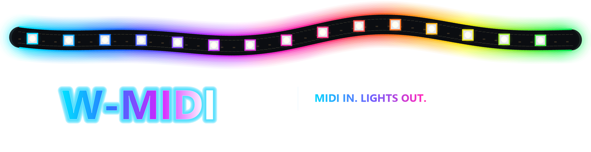

<<<<<<< HEAD
# W-MIDI



W-MIDI connects MIDI input to WLED realtime UDP lighting. The `v1.1.0`
desktop app supports multiple independent bridges, virtual MIDI ports, palette
preview and scaling, realtime LED visualization, and custom 2D LED layouts.

## Portable Windows Release

1. Download and extract the complete `W-MIDI-v1.1.0.zip` archive.
2. Keep `W-MIDI.exe` and `_internal/` together in the extracted folder.
3. Start `W-MIDI.exe`.

Python and the application dependencies are bundled with the Windows release.

## Quick Start

1. Select a MIDI input.
2. Enter the WLED IP or use `Find WLED`.
3. Keep UDP port `21324` unless your WLED setup uses another port.
4. Set LED count, start note, and optional LEDs per channel.
5. Select a palette and start the bridge.

Use `Test Connection` to check the controller and `Save Config` to store the
workspace in `config.json`.

## Features

### Multiple Bridges

- Use the numbered circles on the left to switch between bridge instances.
- Use `+` to add and `-` to remove an instance.
- Each bridge keeps independent MIDI, WLED, palette, layout, and log settings.
- Running bridges continue uninterrupted while another tab is selected.

### Virtual MIDI Ports

Install [loopMIDI](https://www.tobias-erichsen.de/software/loopmidi.html) once
so the virtualMIDI driver is available. The loopMIDI app itself does not need
to be open. Click `Create New Midi Port`, enter a name, and choose `Add`.
Ports created by W-MIDI are temporary and disappear when W-MIDI closes.

### Color Engine

- Choose a palette from the `palettes/` dropdown.
- W-MIDI supports `velocity:R,G,B` files and Launchpad-style
  `0, R G B;` files.
- The 128-color preview shows the currently selected palette.
- The sun button scales Launchpad-style `0..63` RGB values to `0..255` for the
  selected bridge. The moon button restores the original values.
- Scaling is applied only at runtime. Palette files are never modified.

### LED Preview And Layout Editor

- The LED/MIDI Mapping card mirrors the exact realtime colors sent to WLED.
- The number of preview squares follows `Total LED Count`.
- Click `POP OUT` to open a larger live preview.
- Use `EDIT LAYOUT` to drag LEDs into a custom 2D arrangement.
- Drag a selection rectangle to select several LEDs, then move or rotate them
  together.
- Layouts can be reset, saved as JSON, and imported again.
- Custom layouts are stored independently for each bridge.

### Mapping

The base mapping is:

```text
led_index = midi_note - base_note
```

For larger setups, `LEDs per channel` assigns a separate LED bank to every
MIDI channel.

## Included Palettes And Layouts

The release includes palettes in `palettes/` and reusable JSON examples in
`layouts/`. The default palette is `palettes/Default`.

## Source Development

Install Python 3.10 or newer and the dependencies:

```powershell
py -3 -m pip install -r requirements.txt
```

### Command Line
=======


This is all based on an ESP32 running WLED, for further help see any tutorial on YouTube, for example: https://www.youtube.com/watch?v=exAWzMfmwQ8&t=375s

# W-MIDI

W-MIDI translates MIDI input into WLED realtime UDP lighting frames. It is built
for live LED control from a MIDI keyboard, controller, DAW, or virtual MIDI
port.

The desktop app is the recommended way to use W-MIDI. Command-line entry points
are still included for testing, automation, and advanced setups.

## Transparency

I'm no Pro Coder or anything, everything here was made using Codex (ChatGPT).

## Example use Case:

Full Example and Setup Tutorial: [W-MIDI Tutorial Guide.pdf](https://github.com/user-attachments/files/28325907/W-MIDI.Tutorial.Guide.pdf)

Side Note: Stop the Bridge before making any changes and save before starting again.

## Release Layout

```text
W-MIDI/
|-- W-MIDI.exe
|-- README.md
|-- README_EN.txt
|-- README.txt
|-- LICENSE.txt
|-- CHANGELOG.md
|-- RELEASE_CHECKLIST.md
|-- config.example.json
|-- requirements.txt
|-- pyproject.toml
|-- midi_wled_bridge/
|   |-- bridge.py
|   |-- cli.py
|   |-- gui.py
|   |-- midi_tester.py
|   |-- palette.py
|   |-- ports.py
|   `-- ...
|-- palettes/
|   `-- velocity_palette.txt
|-- scripts/
|   `-- windows/
|      |-- start_w_midi.bat
|      |-- start_gui.bat
|      |-- start_wled_midi_bridge.bat
|      |-- midi_input_tester.bat
|      `-- test_wled_udp.bat
|-- packaging/
|   `-- windows/
|      `-- build_w_midi_launcher.bat
|-- tools/
|   `-- windows/
|      `-- GuiLauncher.cs
`-- tests/
```

## Installation

```powershell
cd "C:\YOURLOCALSAVE\W-MIDI-1.0.0"
py -3 -m pip install -r requirements.txt
```

## Quick Start

1. Start `W-MIDI.exe`.
2. Select the MIDI input device.
3. Enter the WLED controller IP address.
4. Keep the UDP port at `21324` unless your WLED setup uses a custom port.
5. Set LED count and base note.
6. Click `Start Bridge`.

The `?` icon in the app opens `README_EN.txt`.

## Command-Line Use
>>>>>>> eabdd911b25d79a2bbd5c264e3d24a69dda49ce7

List MIDI ports:

```powershell
py -3 -m midi_wled_bridge.midi_tester --list-only
```

<<<<<<< HEAD
Start the desktop app without the launcher:

```powershell
py -3 -m midi_wled_bridge.qt_gui
```

The CLI is still available for advanced setups:

```powershell
py -3 -m midi_wled_bridge.cli --help
```

## Build And Verify

```powershell
py -3 -m unittest discover -s tests
py -3 -m compileall -q midi_wled_bridge tests
powershell -ExecutionPolicy Bypass -File packaging\windows\build_release_archive.ps1
```

The archive is written to `release/W-MIDI-v1.1.0.zip`. See
`RELEASE_CHECKLIST.md` before publishing it on GitHub.
=======
Start the bridge:

```powershell
py -3 -m midi_wled_bridge.cli --wled-ip 192.168.1.100 --midi-port "loopMIDI" --led-count 64 --base-note 36 --color-mode velocity_palette --velocity-palette-file "palettes/velocity_palette.txt"
```

Start the GUI without the launcher:

```powershell
py -3 -m midi_wled_bridge.gui
```

## GUI Features

- Configure WLED IP, WLED port, MIDI port, LED count, and base note.
- Listen to all MIDI channels or a single selected channel.
- Split larger LED installations into MIDI channel banks.
- Choose fixed colors, velocity palettes, white/red/blue velocity modes, or rainbow note mapping.
- Tune frame interval and MIDI processing burst for performance.
- Save settings to `config.json`.
- View and pop out the live bridge log.

## Mapping

W-MIDI uses linear note mapping:

```text
led_index = midi_note - base_note
```

For larger LED setups, set `channel_bank_size` or `--channel-bank-size`.
With a value of `100`, MIDI channel 1 maps to LEDs `0..99`, channel 2 maps to
`100..199`, channel 3 maps to `200..299`, and so on.

## Color Modes

- `fixed`
- `velocity_palette`
- `velocity_white`
- `velocity_red`
- `velocity_blue`
- `rainbow_note`

When `velocity_palette` is selected and a velocity is not defined exactly, the
nearest defined velocity in the palette is used.

## Building The Windows Launcher

From a Visual Studio Developer Command Prompt:

```powershell
packaging\windows\build_w_midi_launcher.bat
```

This creates `W-MIDI.exe` in the project root.
>>>>>>> eabdd911b25d79a2bbd5c264e3d24a69dda49ce7
